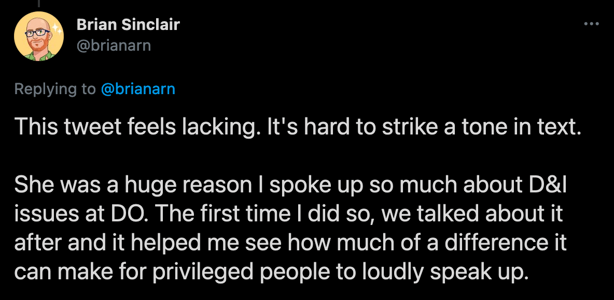
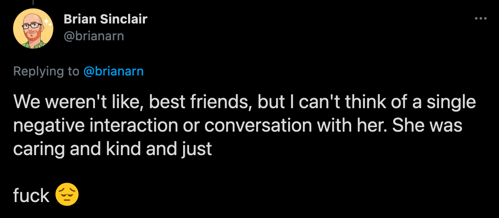

[cw death]

Hollie had an absolutely amazing energy, affable and gregarious. She was absolutely wonderful.

We didn't work directly together on a team, but we collaborated on several projects, and she was just fantastic to work with.

Rest in peace, [@raetoes](https://twitter.com/raetoes). 💙

-Brian Sinclair

[Link to Tweet](https://twitter.com/brianarn/status/1368734687905030147)

***

This tweet feels lacking. It's hard to strike a tone in text.

She was a huge reason I spoke up so much about D&I issues at DO. The first time I did so, we talked about it after and it helped me see how much of a difference it can make for privileged people to loudly speak up.

-Brian Sinclair

[Link to Tweet](https://twitter.com/brianarn/status/1368736451106508801)

***

We weren't like, best friends, but I can't think of a single negative interaction or conversation with her. She was caring and kind and just

fuck 

-Brian Sinclair

[Link to Tweet](https://twitter.com/brianarn/status/1368736451970568192)

