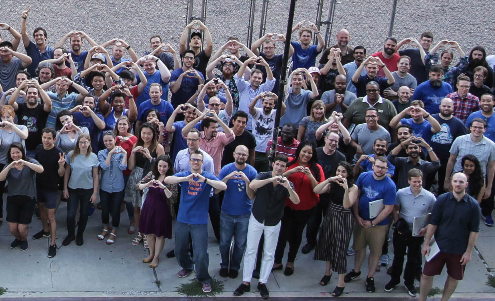
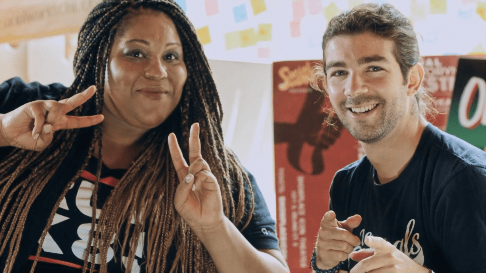
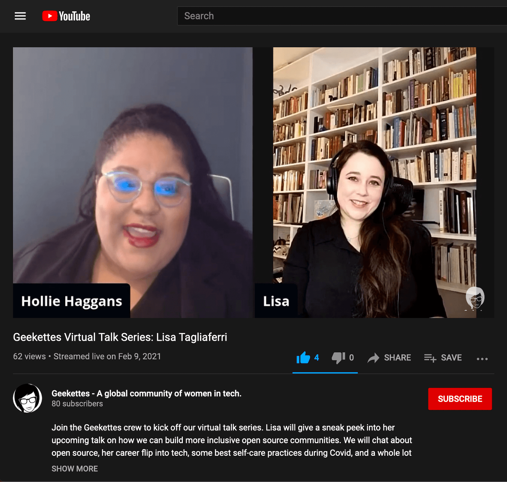
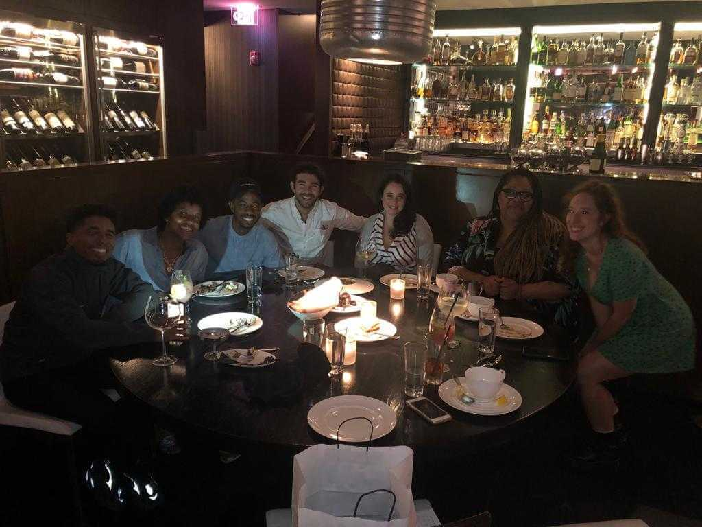
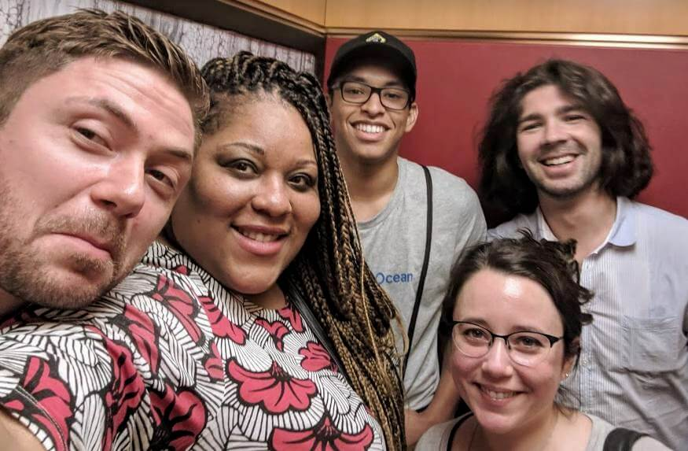

I met Hollie Haggans five years ago when I joined the team at DigitalOcean, a cloud computing company based in New York City. Hollie was like the heart of the organization, and immediately welcomed me, bringing me into the fold of all that was happening. Hollie was a master of community work, creating and leveraging connections to make something meaningful. To build a robust network requires tenacity, acumen, and emotional intelligence, and Hollie was peerless when it came to using those skills to envision a more inclusive global tech community. Hollie was deeply connected throughout tech, from startups to VCs to nonprofits to mega international companies. She had extraordinary insight, always knowing the right person to call in when something needed to be done. Hollie was also gracious and empathetic, with an ability to diffuse even fraught conversations in a way that made everyone better people afterwards. More than anything, Hollie made everyone feel like they truly belonged.

I feel very fortunate to have been able to work closely with Hollie on the projects that meant the most to me the past few years. The highlight for me while working at DigitalOcean was [the Spin Up](https://www.digitalocean.com/the-spin-up/), which was a program to help Black students get into tech. Hollie led this work, connecting with [a16z’s Cultural Leadership Fund](https://a16z.com/cultural-leadership-fund/) nonprofits that could benefit from open source education and cloud infrastructure, and delivering desperately needed inspiration to the next generation of technologists. Hollie and I also collaborated throughout the years on [Geekettes](https://www.geekettes.io/) programming, an organization she co-founded to help more women get into tech. 

Recently, I was able to have some extra special time with Hollie as it was a transition in our relationship: I left DigitalOcean for an opportunity with Sourcegraph, and Hollie and I were collaborating closely to ramp up the NYC Geekettes chapter. I was able to tell her how much I respected her leadership and how she was a role model to me. Hollie was a very special person with a bright light that I believe persists in the world, and I am comforted that I was able to candidly express to her how much she meant to me and the impact she had on my life. Although the pandemic has been isolating, the collective grieving I have had access to online has only further demonstrated how vast her community is; I don't know how she did it but she had hundreds of meaningful friendships with people who would have followed her leadership many times over just as I had done.

Hollie’s life was rich and she made incredible strides in the work she wanted to accomplish in the time she was with us: in making tech more inclusive, helping people up the ladder behind her, and paving the way for future generations to build the technology that many underrepresented communities seriously need. Still, it is inconsolably saddening to think about the time she did not have to relish in the rewards of her work, enjoy life after covid, and continue to build and grow communities. And it is heartbreaking to lose a friend.

My favorite memory of Hollie was when we were in Chicago to pilot the Spin Up at Social Works, and the crew was all in an Uber together. Hollie sat in the front, next to the driver, while our colleague and friend Daniel, her nephew Damon, the videographer Max, and I were in the back rows. The driver was from Israel — they had never met before, but Hollie effortlessly spoke with him as though they were old friends. They compared airports around the world (I hear you’ve got to go to Singapore’s Changi Airport), discussing airport interior design like carpets in great detail. Hollie was well traveled, had good taste, was quick to joke, and had a deep and infectious laugh. 

Hollie, we will miss you. The communities that you have touched will continue to carry your work forward and honor your spirit. 

-Lisa Tagliaferri

