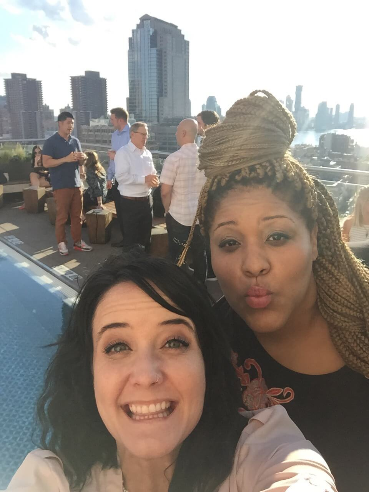
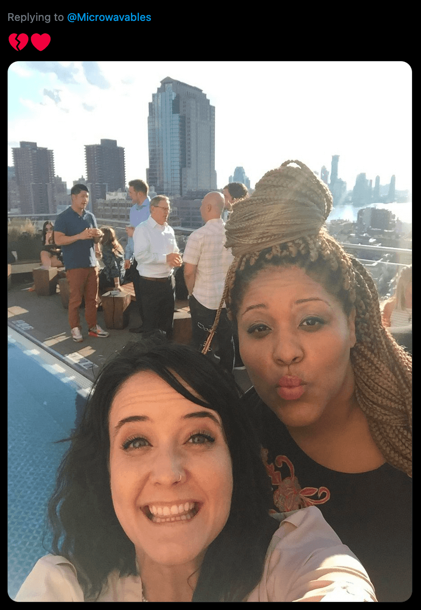
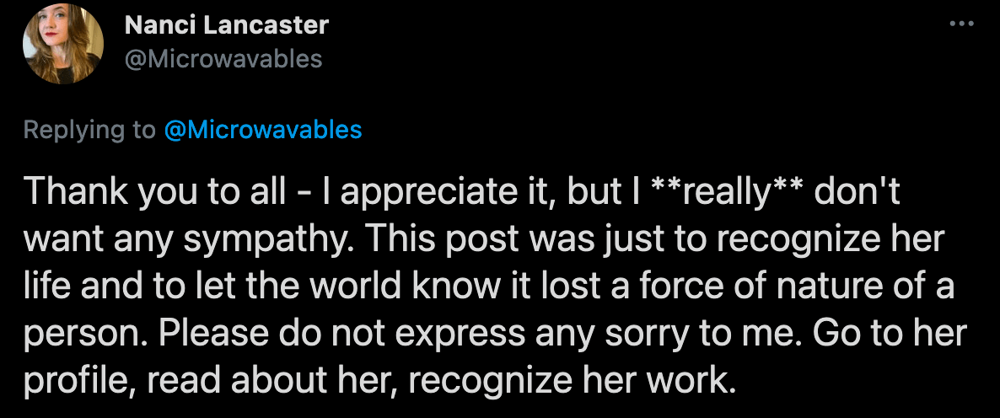

She was my workaholic PIC at DigitalOcean. Just her and I in the office working til 11pm, ordering dinner, drinking wine, talking endlessly. We were inseparable until we weren’t. What a monumentally devastating loss on so many levels. Rest in power [@raetoes](https://twitter.com/raetoes), you mf’n badass soul.

-Nanci Lancaster

[Link to Tweet](https://twitter.com/Microwavables/status/1368697907369697282)

***

💔❤️

-Nanci Lancaster

[Link to Tweet](https://twitter.com/Microwavables/status/1368698713007398924)

***

Thank you to all - I appreciate it, but I **really** don't want any sympathy. This post was just to recognize her life and to let the world know it lost a force of nature of a person. Please do not express any sorry to me. Go to her profile, read about her, recognize her work.

-Nanci Lancaster

[Link to Tweet](https://twitter.com/Microwavables/status/1368708343498424324)

